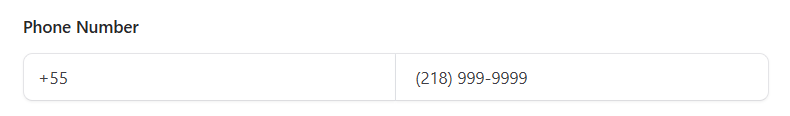

# Bug: Formatação errada para telefone brasileiro

## Problema
O campo de telefone formata números brasileiros como se fossem americanos.

## Como reproduzir
1. Clicar no campo "Phone Number"
2. Digitar um número brasileiro: "11999887766"
3. Observar como fica formatado

## O que acontece
- Digito: 22999887766
- Sistema formata: (229) 998-87766
- Formato fica errado para número brasileiro pois é o padrão americano

## O que deveria acontecer
- Número brasileiro deveria ficar: (22) 99988-7766
- Formatação deveria ser adequada para o país

## Gravidade
**Médio** - Não impede cadastro, mas deixa número mal formatado

## Imagens do bug
