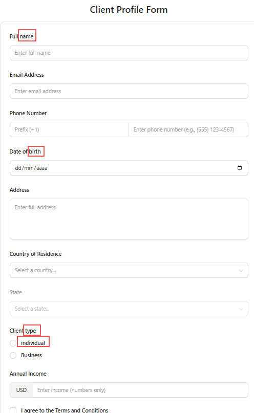

# Bug: Capitalização de termos 

## Problema
Alguns termos estão com as capitalizações erradas na ortografia, começando com letras minúsculas sendo que deveriam ser maiúsculas.

## Como reproduzir
1. Acessar o formulário
2. Verificar que diversos termos como "Phone Number" estão corretos enquanto alguns como "Full name" estão incorretos

## O que acontece
- Alguns termos do formulário estão capitalizadas erradas, como "Full name" ou "Client type"

## O que deveria acontecer
- Os termos deveriam estar capitalizados corretamente

## Gravidade
**Baixo** - Erro de UI/UX que não afeta usabilidade mas afeta qualidade geral.

## Imagens do bug
