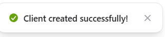

# Casos de Teste - CT001: Formulário de cadastro com dados válidos

**Pré-condições:**
- Acessar o site: [Formulário](https://qa-training.sbx.devsquad.app/).

**Passos:**
1. Abrir o site informado
2. Preencher "Full Name": "João Silva"
3. Preencher "Email Address: "joaoteste@hotmail.com"  
4. Preencher DDI + "Phone Number": "55", "22999888777"
5. Escolher "Date of birth": "24/09/1998"
6. Preencher "Address": "Rua dos testes, 123 - Rio de Janeiro/RJ"
7. Escolher "Country of Residence": "Brazil"
8. Escolher "State": "Rio de Janeiro"
9. Escolher "Client type": "individual"
10. Preencher "Annual Income": "100000"
11. Marcar os termos em "I Agree to the Terms and Conditions
12. Clicar em "Submit"

**Resultado esperado:** Formulário envia com sucesso e aparece uma mensagem "Client created succesfully!"

**Resultado obtido:** Mesmo que o esperado

**Status:** Passou

## Imagens do teste

