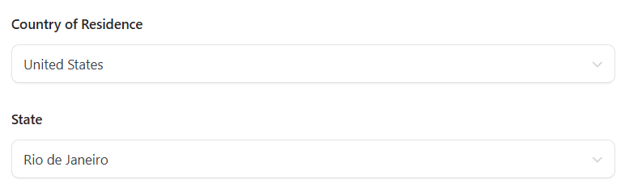

# Casos de Teste - CT004: Mudança de estados mudam quando modificam o país

**Objetivo:** Testar se ao selecionar o país "Brazil" aparecem apenas os estados deste país
**Pré-condições:**
- Acessar o site: [Formulário](https://qa-training.sbx.devsquad.app/).

**Passos:**
1. Abrir o site informado
2. Escolher "Country of Residence": "Brazil"
3. Verificar se aparecem apenas estados do país selecionado
4. Escolher "State": "Rio de Janeiro"

**Resultado esperado:** Ao selecionar o país é esperado que apareçam todos os estados do país selecionado anteriormente de forma correta

**Resultado obtido:** Ao selecionar o país os estados não mudam, permanecendo estados de outros países para escolha, o que pode gerar confusão ao usuário e o cadastro é feito normalmente com informações errôneas

**Status:** Falhou

## Imagens do teste

